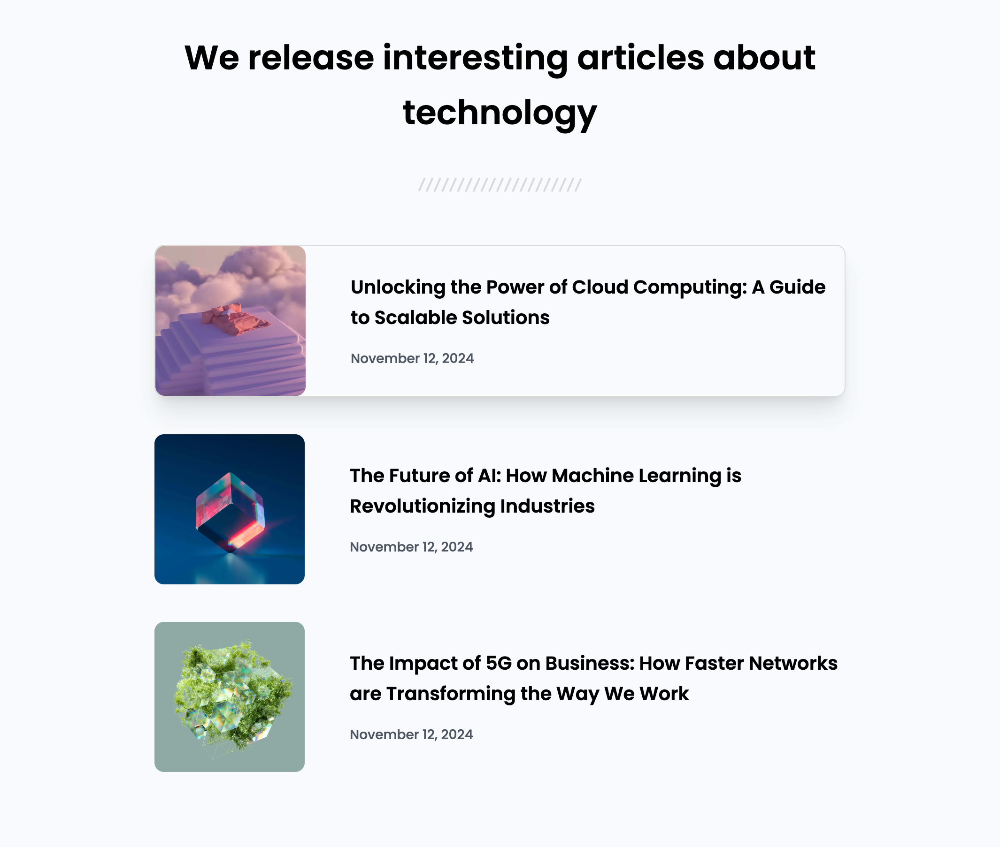

<h1 align="center">Simple Article Listing | devChallenges</h1>

   Solution for the challenge <a href="https://devchallenges.io/challenge/html-css-article-listing-page-BdKjFdZhMvIjvWqVmeS3" target="_blank">Simple Article Listing</a> from <a href="https://devchallenges.io" target="_blank">devChallenges.io</a>.

  <h3>
    <a href="https://devulya.github.io/Simple-Article-Listing">
      Demo
    </a>
     | 
    <a href="https://github.com/devulya/Simple-Article-Listing">
      Solution
    </a>
     | 
    <a href="https://devchallenges.io/challenge/html-css-article-listing-page-BdKjFdZhMvIjvWqVmeS3">
      Challenge
    </a>
  </h3>

## Table of Contents

- [Overview](#overview)
  - [Useful Resources](#useful-resources)
- [Built With](#built-with)
- [Features](#features)
- [Contact](#contact)

## Overview

This is a responsive article listing layout built as part of the [Simple Article Listing](https://devchallenges.io/challenge/html-css-article-listing-page-BdKjFdZhMvIjvWqVmeS3) challenge on devChallenges.io. The goal of the project was to practice working with HTML and CSS layout techniques, especially Flexbox, while structuring content with `<article>` elements and designing clean, readable interfaces.

Key learning goals:
- Understanding basic HTML and CSS syntax
- Using Flexbox to create responsive layouts
- Structuring content with semantic elements like `<article>`, ``, and `<time>`
- Styling text, spacing, and images for a visually appealing layout

### Useful Resources

- [Tailwind CSS Docs](https://tailwindcss.com/docs) – Utility-first CSS framework documentation
- [MDN Web Docs – Flexbox](https://developer.mozilla.org/en-US/docs/Web/CSS/CSS_flexible_box_layout/Basic_concepts_of_flexbox)
- [Google Fonts – Inter](https://fonts.google.com/specimen/Inter) – Clean and professional typeface

## Built With

- Semantic HTML5
- Tailwind CSS (via CDN)
- Google Fonts (Poppins)
- Flexbox for layout
- Responsive design techniques

## Features

- Responsive list of articles with image, title, and date
- Modern and clean layout using Flexbox
- Semantic and accessible HTML structure
- Mobile-first design with adaptive image rendering

## Contact

- GitHub [@devulya](https://github.com/devulya)
